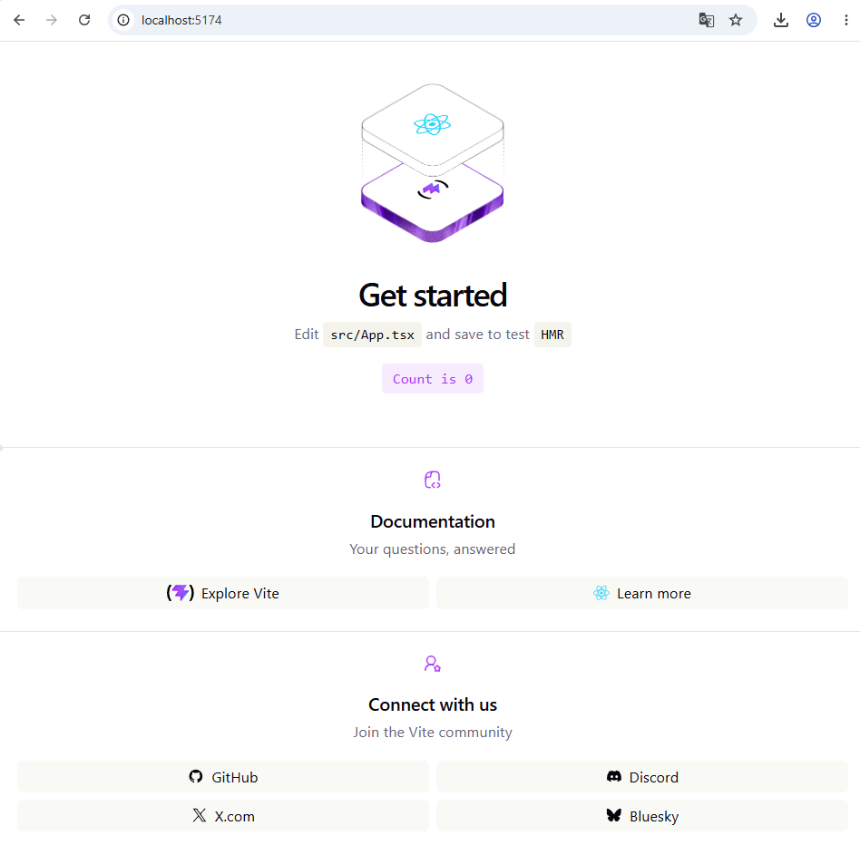
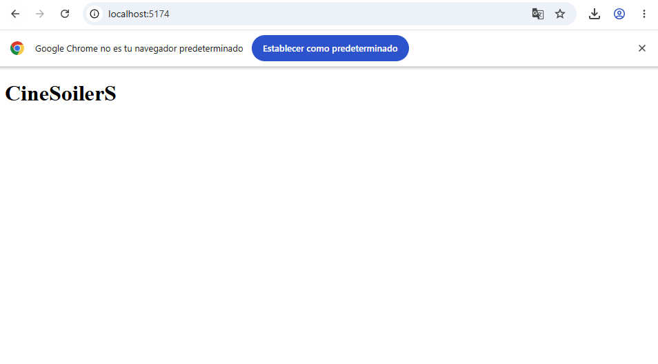
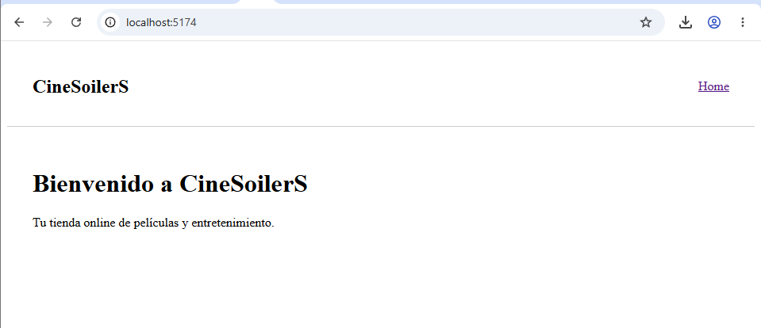
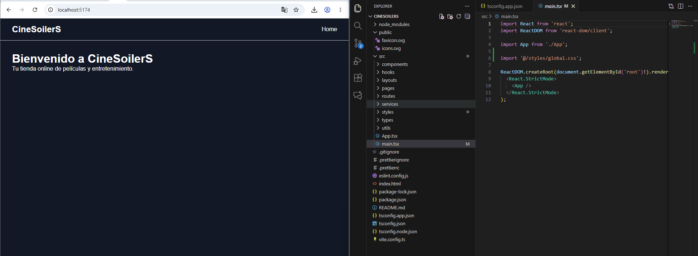
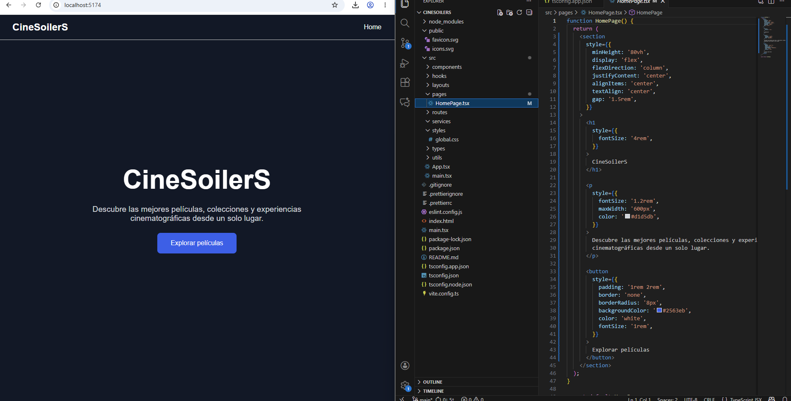
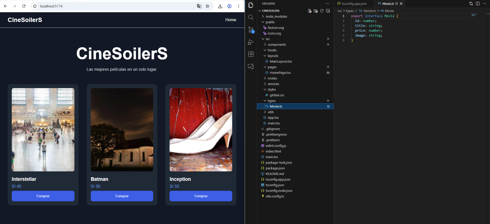
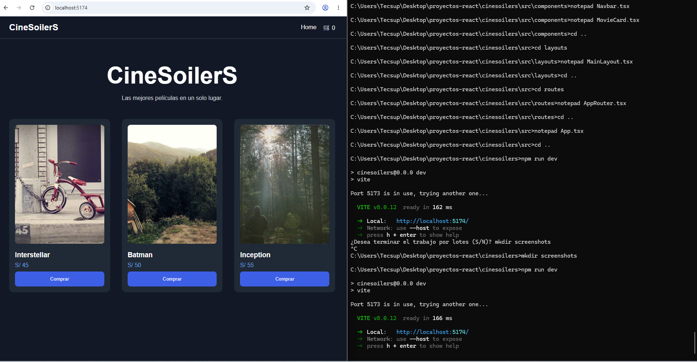

# 🎬 CineSoilerS
Aplicación e-commerce de películas desarrollada con React, TypeScript y Vite. Permite explorar películas, agregarlas al carrito y realizar pagos mediante una pasarela integrada. Base escalable con las mejores convenciones de proyectos React modernos.

## Evidencias - Sheila Diaz

### 🟢 Inicio del proyecto
Se creó el proyecto con Vite + React + TypeScript, se limpió el template por defecto y se dejó la estructura lista para crecer.

### 🏠 Título inicial de la app
Primera prueba del nombre de la aplicación renderizado en el navegador.

### 🧱 Estructura del proyecto en VS Code
Se organizaron las carpetas por responsabilidad: `components`, `hooks`, `layouts`, `pages`, `routes`, `services`, `styles`, `types` y `utils`.

### 🌟 Home principal con hero section
Se implementó la página principal con título, descripción y botón de llamada a la acción, usando flexbox y estilos inline con fondo oscuro.

### 🎬 Hero con botón Explorar películas
Se añadió el botón "Explorar películas" con estilos y navegación básica hacia el catálogo.

### 🃏 Movie Cards con catálogo de películas
Se crearon cards dinámicas con imagen, título, precio en soles y botón de compra. Se tipó el modelo `Movie` con TypeScript.

### ⚙️ App en ejecución
Se validó el funcionamiento completo con `npm run dev`, Vite corriendo en `localhost:5174` y la estructura final del proyecto lista.
