# 🎬 CineSoilerS
Aplicación e-commerce de películas desarrollada con React, TypeScript y Vite. Permite explorar películas, agregarlas al carrito y realizar pagos mediante una pasarela integrada. Base escalable con las mejores convenciones de proyectos React modernos.

## Evidencias - Sheila Diaz

### 🟢 Inicio del proyecto
Se creó el proyecto con Vite + React + TypeScript, se limpió el template por defecto y se dejó la estructura lista para crecer.

### 🏠 Título inicial de la app
Primera prueba del nombre de la aplicación renderizado en el navegador.

### 🏠 Home principal con navbar
Se implementó el layout principal con navbar que incluye el nombre de la app y enlace Home, mostrando el mensaje de bienvenida.

### 🧱 Estructura del proyecto en VS Code
Se organizaron las carpetas por responsabilidad: `components`, `hooks`, `layouts`, `pages`, `routes`, `services`, `styles`, `types` y `utils`. Se muestra el archivo `main.tsx` con la configuración inicial de React.

### 🎬 Hero con botón Explorar películas
Se añadió el botón "Explorar películas" con estilos y navegación básica hacia el catálogo.

### 🃏 Movie Cards con catálogo de películas
Se crearon cards dinámicas con imagen, título, precio en soles y botón de compra. Se tipó el modelo `Movie` con TypeScript.

### ⚙️ App en ejecución
Se validó el funcionamiento completo con `npm run dev`, Vite corriendo en `localhost:5174` y la estructura final del proyecto lista.

# CineSpoilerS 🎬🛒

Proyecto frontend desarrollado con React + Vite + TypeScript para una plataforma e-commerce básica orientada a productos relacionados con cine.  
Esta primera versión establece la base para futuras funcionalidades como autenticación, integración de pasarela de pagos y escalabilidad del catálogo.

---

## Tecnologías utilizadas

- React
- TypeScript
- Vite
- Tailwind CSS
- React Router DOM
- Axios
- Git / GitHub

---

## Objetivo del avance

Implementar la estructura inicial del frontend del proyecto:

- Configuración del entorno de desarrollo
- Inicialización del proyecto React
- Organización de carpetas
- Navegación con rutas
- Catálogo de productos
- Carrito de compras básico
- Gestión de versiones en rama personal

---

## Desarrollo paso a paso

### 1. Creación del proyecto base con Vite

Inicialización del proyecto con React + TypeScript y verificación del servidor local.

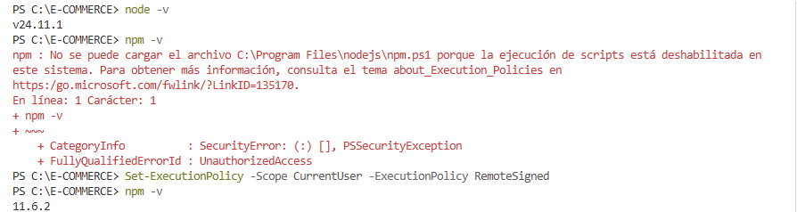
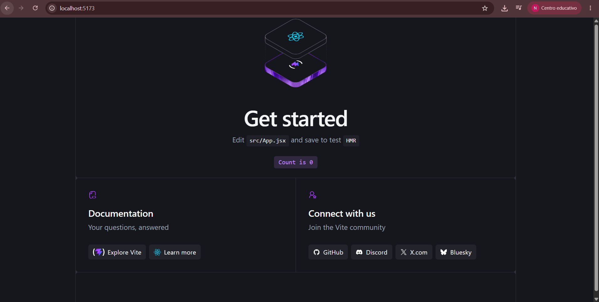

---

### 2. Limpieza del proyecto inicial

Inicialización del Proyecto desde la terminal

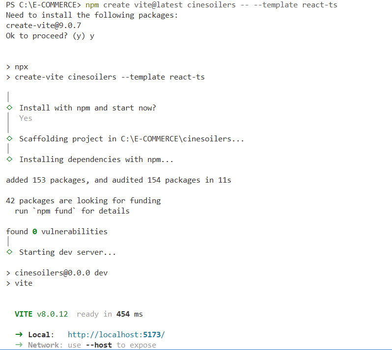

---

### 3. Primera Ejecución 

CineSpoilers

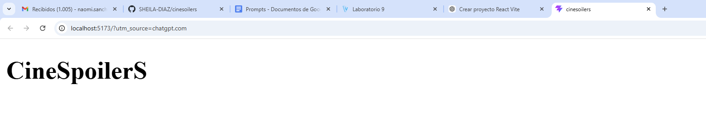

---

### 4. Código y estructura completa de archivos

Código y estructura completa de archivos

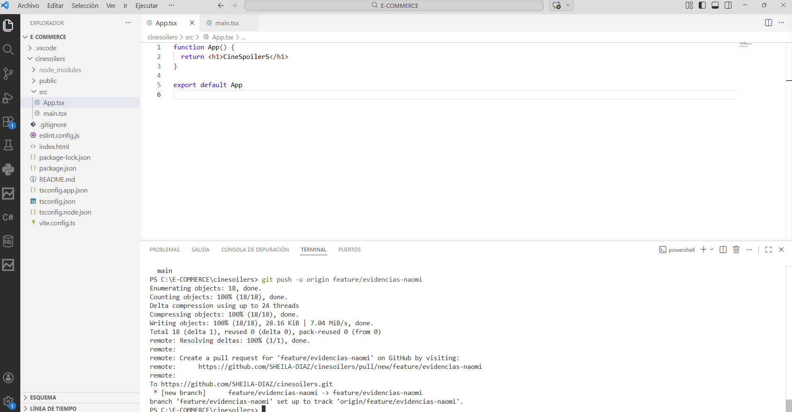

---

### 5. Inicialización de las pruebas desde el localhost 

Inicialización de las pruebas desde el localhost 

---

### 6. Primera pantalla Home

Implementación de la página principal del sistema.

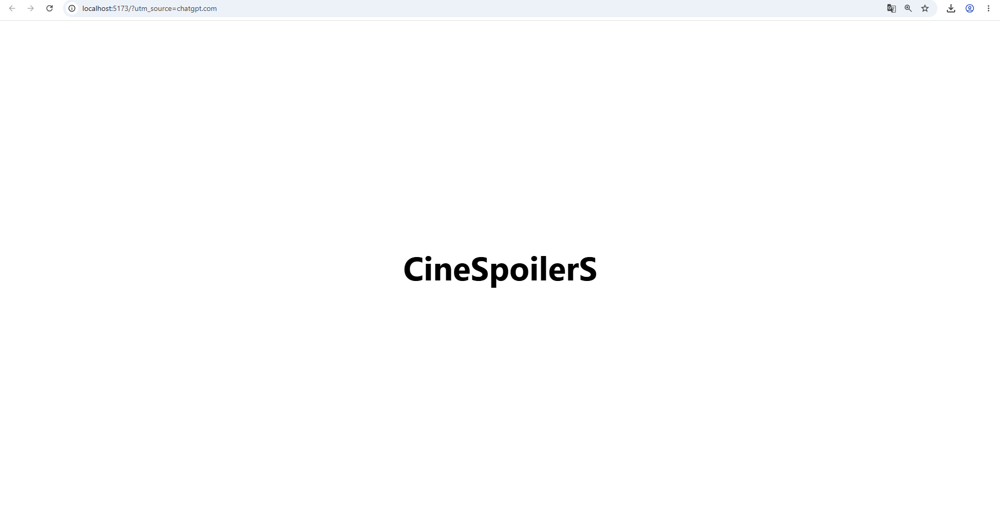
---

### 7. Segunda Ejecución

Pruebas en el locahost1

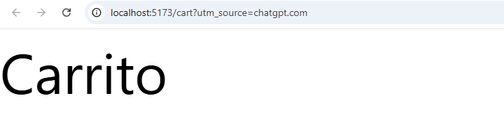

---

### 8. Tercera Ejecución
Pruebas en el locahost2

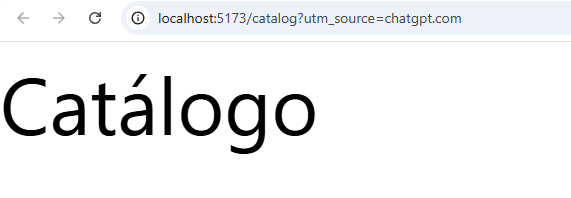

---

### 9. Implementación Final de Inicio

Vista funcional de Inicio

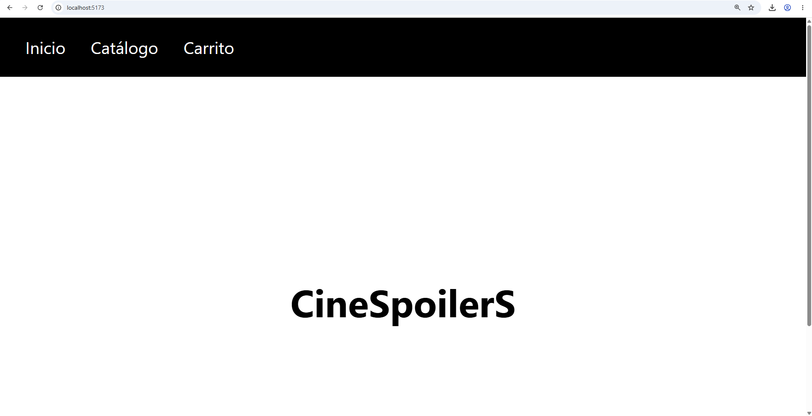

---

### 10. Implementación Final del Catalago

Vista funcional del catalago

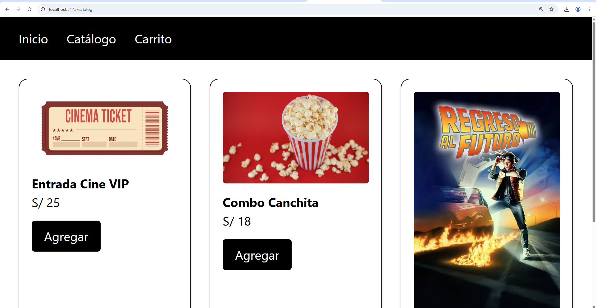

---

### 11. Implementación Final del Carrito

Vista funcional del carrito

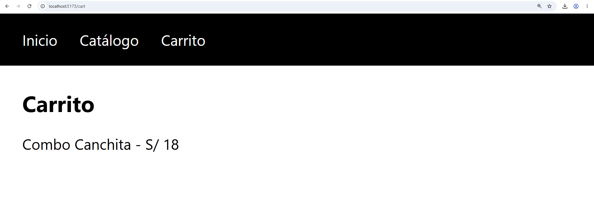

---

## Estado actual

Actualmente el proyecto cuenta con:

✅ Navegación entre páginas  
✅ Catálogo inicial  
✅ Carrito funcional  
✅ Estructura escalable  
✅ Base lista para integración de pagos  

---

## Próximas mejoras

- Integración con API backend
- Pasarela de pagos
- Autenticación de usuarios
- Persistencia del carrito
- Diseño responsive completo
- Panel administrativo

---

## Autor

Desarrollado por Naomi Sánchez como avance del proyecto CineSpoilerS.
